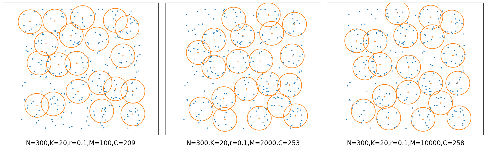
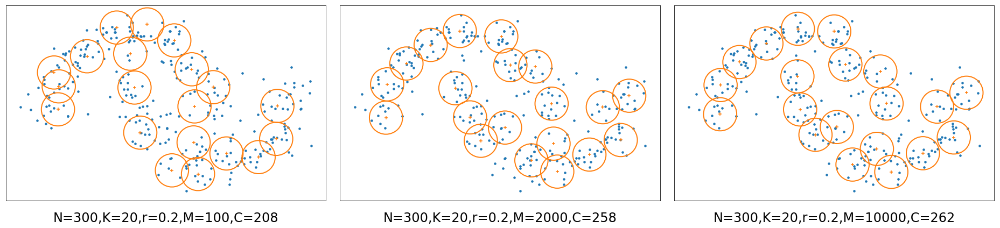
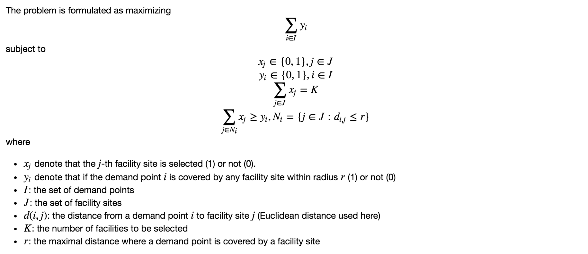

## Maximum coverage location problem (MCLP)

This repository provides a Python implementation of solving a classical instance of
the **maximum coverage location problem** described in Church 1974. 

The problem is defined as: given **N** points, find **K** circles with radius of **r** 
to cover as many points as possible.

- Example 1: Select 20 circles with radius of 0.1 to cover 300 points (uniform distribution)



(M is the number of candidate sites and C is the number of points covered)

- Example 2: Select 20 circles with radius of 0.2 to cover 300 points (moon distribution)




### Problem formulation

The method randomly generates a set of candidate sites within the region
of the input points. The problem is then solved by integer programming.

The mathematical formulation is given below:




### Demo and usage

Check the jupyter-notebook [demo.ipynb](demo.ipynb).

To run the example interactively, inside the project directory type the command
```
jupyter-notebook
```

### Requirements

- Python 2.7
- Scipy, Numpy (available as part of [Anaconda](https://www.anaconda.com/))
- [Shapely](https://github.com/Toblerity/Shapely)
- [Gurobi](https://www.gurobi.com/), commercial software (free for academic usage)

It is recommended to use Anaconda directly, where the packages can be installed with `pip` or `conda`.

```
pip install shapely
conda config --add channels http://conda.anaconda.org/gurobi
conda install gurobi
```

### Contact

Can Yang, Ph.D. student at KTH, Royal Institute of Technology in Sweden

Email: cyang(at)kth.se

Homepage: https://people.kth.se/~cyang/

### Reference

- [Church R, ReVelle C. The maximal covering location problem. Papers in regional science, 1974, 32(1): 101-118.](https://link.springer.com/article/10.1007/BF01942293)
- http://examples.gurobi.com/facility-location/
